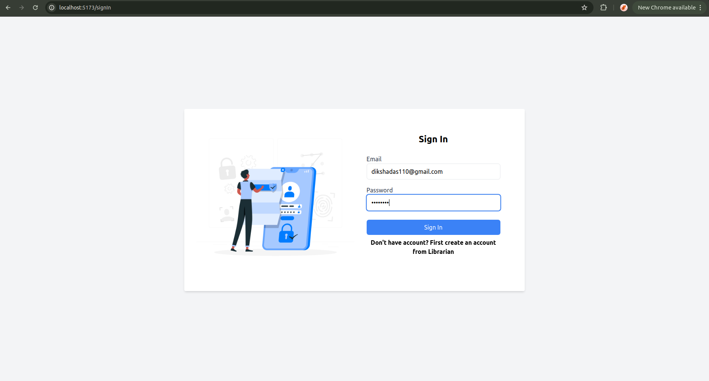
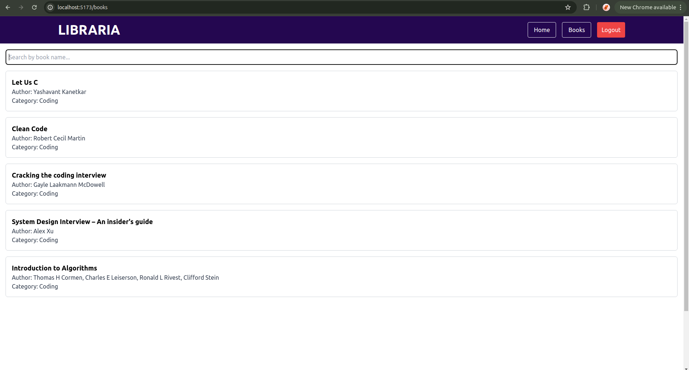
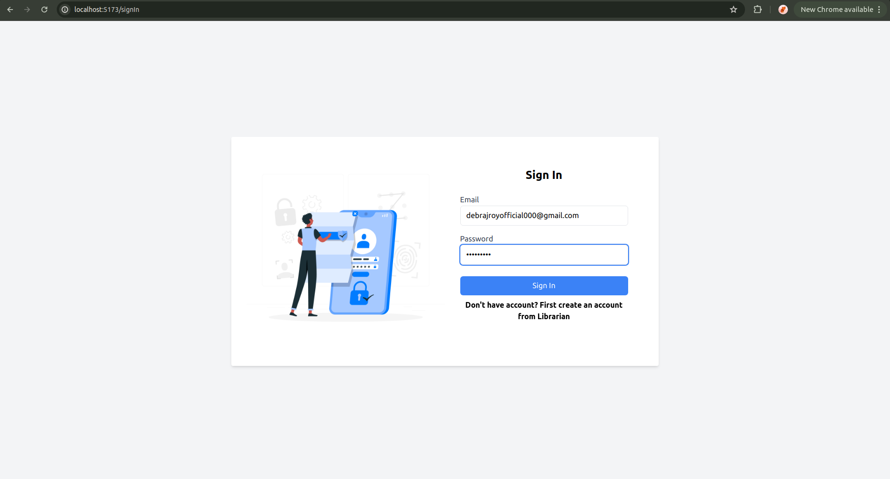
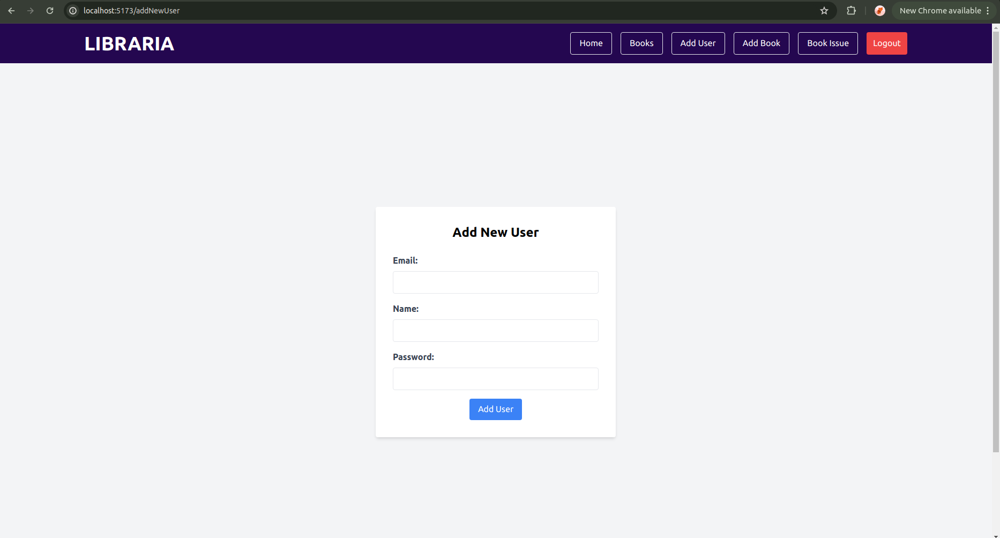
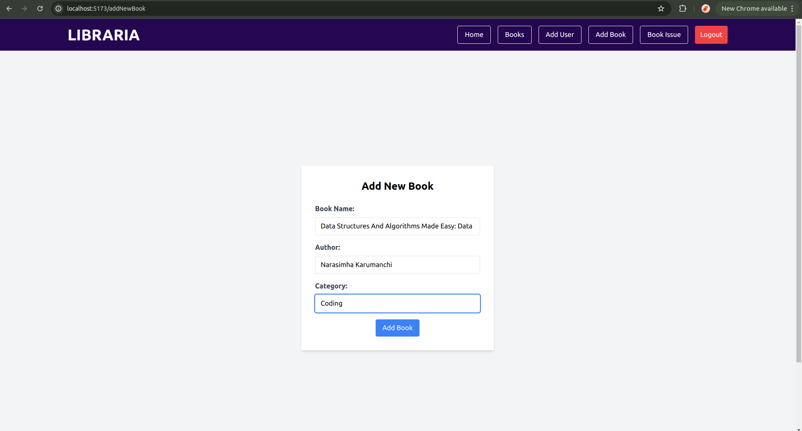
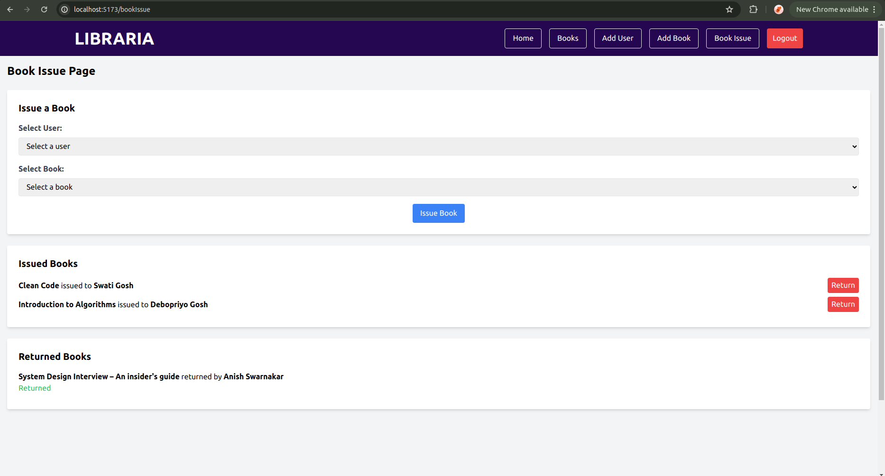

# LIBRARIA - Library Management System

LIBRARIA is a comprehensive library management system designed to streamline the processes of issuing, returning, and managing books and users. The application provides a user-friendly interface for both librarians and library users, enabling efficient library operations.

## Table of Contents

- [LIBRARIA - Library Management System](#libraria---library-management-system)
  - [Table of Contents](#table-of-contents)
  - [Features](#features)
  - [Screenshots](#screenshots)
  - [Installation](#installation)
  - [Usage](#usage)
    - [For Librarians:](#for-librarians)
    - [For Users:](#for-users)
  - [Technologies Used](#technologies-used)

## Features

- **User Authentication**: Secure login and registration system for users and librarians.
- **Book Management**: Add, update, and delete book records.
- **User Management**: Add, update, and delete user records (for librarians).
- **Book Issuing**: Issue books to users with a streamlined interface.
- **Book Returning**: Manage the return of issued books.
- **Responsive Design**: Fully responsive interface for seamless use across devices.
- **Search Functionality**: Easily search for books and users within the system.

## Screenshots


_Caption: User SignIn Page_


_Caption: User Home Page_


_Caption: User Books Page_


_Caption: Admin SignIn Page_


_Caption: Admin Home Page_


_Caption: Admin Add New User Page_


_Caption: Admin Add New Book Page_


_Caption: Admin Add New Book Issue Page_

## Installation

To get started with LIBRARIA, follow these steps:

1. **Clone the repository**:

   ```sh
   git clone https://github.com/debrajroyofficial000/LIBRARIA.git
   cd LIBRARIA
   ```

2. **Install dependencies**:

   ```sh
   npm install
   ```

3. **Set up environment variables**:

   - Create a `.env` file in the root directory.
   - Add the necessary environment variables (e.g., database connection strings, API keys).

4. **Run the application**:

   ```sh
   npm run dev
   ```

5. **Open your browser and navigate to** `http://localhost:5173`.

## Usage

### For Librarians:

1. **Login** with librarian credentials.
2. **Add or manage books** through the Books section.
3. **Add or manage users** through the Users section.
4. **Issue or return books** through the Book Issue section.

### For Users:

1. **Login** with user credentials.
2. **Browse available books**.

## Technologies Used

- **Frontend**: React, React Redux Toolkit, Tailwind CSS
- **Backend**: Appwrite
- **Database**: MySQL
- **Authentication**: JWT (JSON Web Token)
- **State Management**: React Redux Toolkit
- **Routing**: React Router

Thank you for using LIBRARIA! We hope it helps in managing your library efficiently.
